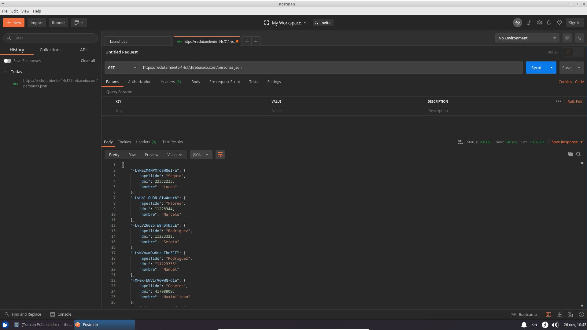
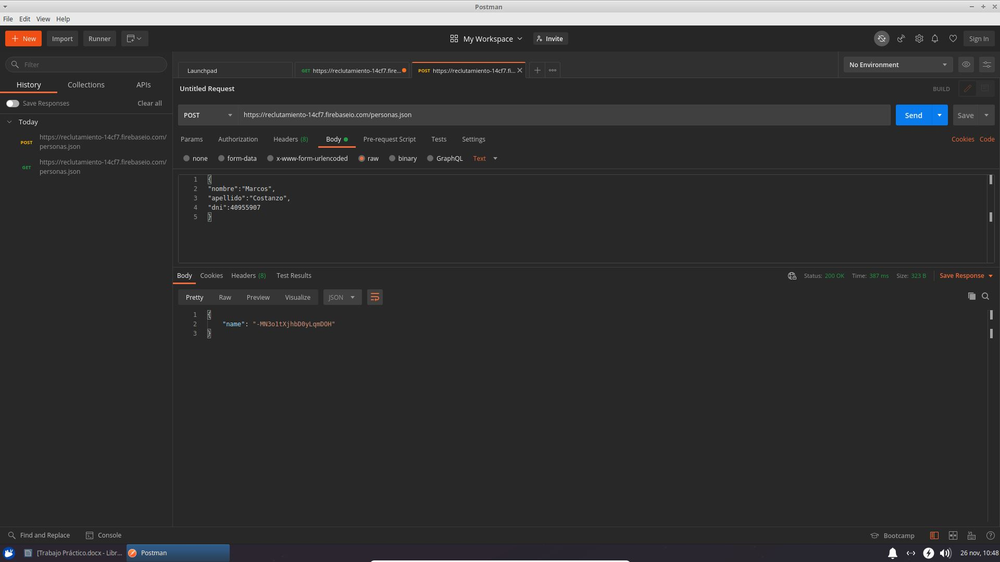
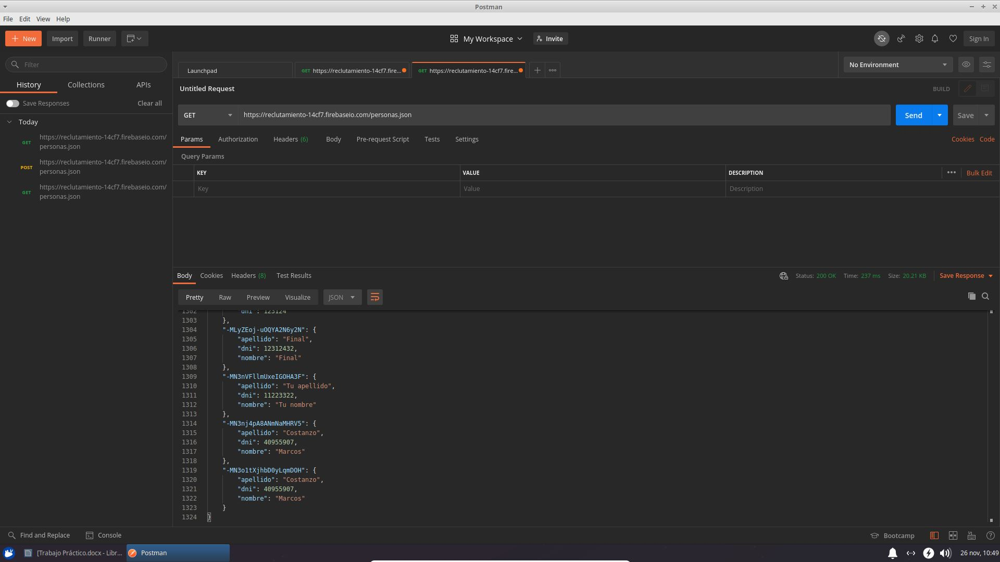

## Ejercicio 2

1. ¿Qué es un servidor HTTP?

   Un servidor HTTP es una pieza de software de comunicaciones que intermedia entre el servidor en el que están alojados los datos solicitados y el computador del cliente, permitiendo conexiones bidireccionales o unidireccionales, síncronas o asíncronas, con cualquier aplicación del cliente. Es decir, se trata de programas que median entre el usuario de Internet y el servidor en donde está la información que solicita.
   
   

2. ¿Qué son los verbos HTTP? Mencionar los más conocidos.

   Los verbos HTTP son los que le indican al servidor qué hacer con los datos identificados por la URL.  HTTP define un conjunto de métodos de petición para indicar la acción que se desea realizar para un recurso determinado. Dentro de los verbos HTTP más conocidos encontramos:

   - GET: indica al servidor que transmita los datos identificados por la URL al cliente. Obtiene el recurso indicado.

   - PUT: se utiliza cuando se desea crear o actualizar el recurso identificado por la URL. Si el recurso no existe, se crea. Si el recurso existe, se actualiza.

   - DELETE: realiza lo contrario a PUT. Se utiliza cuando se desea eliminar el recurso identificado por la URL.

   - POST: se utiliza para solicitar la creación de un nuevo recurso, es decir, algo que no existía previamente.
     


3. ¿Qué es un request y un response en una comunicación HTTP? ¿Qué son los headers?

   Un request (solicitud HTTP) son mensajes enviados por un cliente, para iniciar una acción en el servidor. Está compuesto por:

   - Método: GET, POST, PUT, etc. Indica que tipo de request es.
   - Path: la URL que se solicita.
   - Protocolo: contiene HTTP y su versión.
   - Headers: contienen información sobre el HTTP request y el navegador.
   - Body: lleva los datos asociados con la petición. Si se envía información al servidor a través de POST o PUT, ésta va en el body.

   Un response (respuesta HTTP) es el mensaje que envía el servidor al cliente tras haber recibido una HTTP request. Está compuesto por:

   - Protocolo: contiene HTTP y su versión.
   - Status code: el código de respuesta. Significa que, por ejemplo, el GET request ha sido satisfactorio y el servidor devolverá los contenidos del documento solicitado.
   - Headers: contienen información sobre el software del servidor, cuando se modificó por última vez el resource solicitado, etcétera.
   - Body: si el servidor devuelve información que no sean headers, van en el body.

   Un header HTTP es una parte fundamental de los mensajes entre clientes y servidores que permiten enviar información adicional junto a una petición o respuesta. Son la parte central de los HTTP request y responses, y transmiten información acerca del navegador del cliente, de la página solicitada, del servidor, etcétera.


4. ¿Qué es un queryString? (En una url)

   Un queryString o cadena de consulta es un fragmento de una URL que transfiere datos adicionales a una página de destino y se utiliza para especificar valores de parámetros al momento de realizar una solicitud. El formato de la cadena de consulta es un par "nombre=valor". La primera cadena de consulta de la URL debe ir precedida del carácter de signo de interrogación (?). Las siguientes cadenas de consulta deben ir precedidas del carácter &.
   


5. ¿Qué es el responseCode? ¿Qué significado tiene los posibles valores devueltos?

   El responseCode o código de respuesta HTTP indican si se ha completado satisfactoriamente una solicitud HTTP específica. Las respuestas se agrupan en cinco clases:

   - Respuestas informativas (100 - 199).
   - Respuestas satisfactorias (200 - 299)
   - Redirecciones (300 - 399).
   - Errores de los clientes (400 - 499).
   - Errores en los servidores (500 - 599).

   
   
6. ¿Cómo se envía data en un Get y cómo en un POST?

   Con el método GET se envía la información codificada al usuario en el header del HTTP request, directamente en la URL. La página web y la información codificada se separan por un signo de interrogación "?". Podemos resaltar las siguientes características:
   
   - Este método envía información en la propia URL, con lo cual tiene caracteres limitados.
   - La información es visible en la URL.
   - No se pueden enviar datos binarios (archivos, imágenes, etcétera).
   
   Con el método POST también se codifica la información, pero ésta se envía a través del body del HTTP request, por lo que no aparece en la URL. Podemos resaltar:
   
   - Este método no tiene límite de cantidad de información a enviar.
   - La información no es visible.
   - Se puede enviar texto normal así como datos binarios (archivos, imágenes, etcétera).  
   
   
   
7. ¿Qué verbo http utiliza el navegador cuando accedemos a una página?

   El verbo HTTP que utiliza el navegador al acceder a una página web es el GET ya que el concepto de éste es obtener la información almacenada en el servidor.

   
   
8. Explicar brevemente qué son las estructuras de datos JSON y XML dando ejemplo de estructuras posibles.

   Las estructuras de datos JSON (JavaScript Object Notation) y XML (Extensible Markup Language) son formatos ligeros de intercambio de datos, que resulta sencillo de leer y escribir para los programadores y simple de interpretar y generar para las máquinas.

   Estructura posible JSON:
	 ```json
   {
      "Usuario": {
        "Nombre": "Marcos",
        "Apellido": "Costanzo",
    		"Edad": "22",
    		"Fecha de nacimiento": {
    			"Dia": 31,
    			"Mes": 1,
    			"Anio": 1998
    		}
    	}
   }
	 ```
   Estructura posible XML:
	 ```xml
   <usuario>
    	<nombre>Marcos</nombre>
    	<apellido>Costanzo</apellido>
    	<edad>22</edad>
    	<fechaNacimiento>
    		<dia>31</dia>
    		<mes>1</mes>
    		<anio>1998</anio>
    	</fechaNacimiento>
   </usuario>
   ```


9. Explicar brevemente el estandar SOAP.

   SOAP (Simple Object Access Protocol) es un estándar basado en XML para la transmisión de mensajes en HTTP y otros protocolos de Internet. Es un protocolo ligero para el intercambio de información en un entorno descentralizado y distribuido.


10. Explicar brevemente el estandar REST Full.

    REST (Representational State Transfer) es una interfaz para conectar varios sistemas basados en protocolos HTTP y nos sirve para obvtener y generar datos y operaciones, devolviendo esos datos en formatos específicos como XML y JSON.

    RESTful se utiliza para referirse a los servicios web que ejecutan la arquitectura REST.
    


11. ¿Qué son los headers en un request? ¿Para qué utilizar el key Content-type en un header?

    Los headers en un request son parámetros que se envían en una solicitud HTTP al servidor para proporcionar información esencial sobre la solicitud en curso. Se utiliza el key Content-type en un header para indicar el media type del recurso. El media type es una cadena enviada junto con el archivo que indica el formato del mismo.

   

## Ejercicio 3

1. GET
	

2. POST
	
	
3. GET
	

Se puede observar que se han agregado los datos enviados en el POST que antes no estaban.


## Ejercicio 4

Comandos a ejecutar por consola:
```
npm install
node mostrarPersonas.js
```


## Ejercicio 5 y 6

Comandos a ejecutar por consola:
```
node main.js
```
